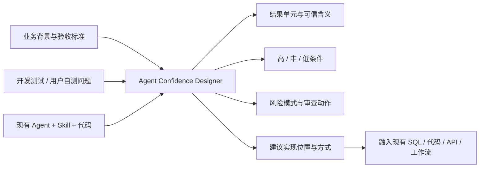

# Agent Confidence

面向业务 Agent + Skill 的可信等级设计最佳实践与通用设计 Skill。

本项目解决的不是“让大模型给自己的答案打分”，也不是建设一套所有业务必须接入的统一置信度平台。它帮助开发人员结合具体业务背景、结果结构、验收标准、开发测试问题和用户自测问题，回答以下问题：

- 应该对哪些结果定义可信等级；
- 每项结果的“高 / 中 / 低”分别意味着什么；
- 哪些业务依据、来源和风险会影响等级；
- 结果是单值、记录、列表还是完整文件时，完整性和覆盖度如何考虑；
- 判断逻辑适合融合到现有 SQL、脚本、API、业务服务、前端还是 Agent 工作流；
- 用户最终只需要检查哪些具体位置。

## 核心边界

本项目提供：

1. **最佳实践文档**：统一分析方法、术语和设计步骤；
2. **`agent-confidence-designer` Skill**：将方法应用到某个具体业务，生成和审查可信等级设计；
3. **设计辅助脚本**：生成设计模板，检查设计文件是否完整、自洽，检查历史问题是否已经进入可信等级设计。

本项目明确不规定：

- 所有业务必须编写独立校验脚本；
- 所有业务必须采用统一验证器接口；
- 所有业务必须输出 `PASS / FAIL / NOT_RUN / UNSUPPORTED / ERROR / NOT_APPLICABLE`；
- 所有业务必须使用统一聚合器；
- 所有业务必须额外建设置信度服务；
- 可信等级逻辑必须与现有业务代码分离。

可信判断逻辑可以直接融合到已有的 Python、Java、TypeScript、SQL、规则引擎、API、工作流或人工审核流程中。最终由业务团队决定什么条件属于高、中、低，以及怎样实现。



## 仓库内容

- [`docs/agent-confidence-best-practices.md`](docs/agent-confidence-best-practices.md)：完整最佳实践；
- [`docs/implementation-guide.md`](docs/implementation-guide.md)：业务项目落地指南；
- [`docs/research-conclusion.md`](docs/research-conclusion.md)：调研结论和范围边界；
- [`skills/agent-confidence-designer`](skills/agent-confidence-designer)：通用设计与审查 Skill；
- [`examples`](examples)：三个经过脱敏的真实业务案例；
- [`tests`](tests)：设计包脚手架和静态检查脚本测试。

## 三个实际案例

| 案例 | 主要可信度问题 |
|---|---|
| SO 合同转换 Agent | 字段来源、规则映射、回退路径、行级风险和 trace 追溯 |
| ECS UAT 自动化 Agent | 规则是否完整匹配、单条测试数据是否正确、测试结果集数量和边界覆盖是否充分 |
| 供应商调查问卷整合 | 历史答案是否适用于当前主体和时间、来源是否权威、答案是否可追溯、是否需要责任部门确认 |

案例均只保留与方法相关的脱敏信息，不包含私有仓库代码、客户文件或真实敏感数据。

## 快速开始

### 1. 生成业务可信等级设计包

```bash
python skills/agent-confidence-designer/scripts/scaffold_confidence_package.py \
  --agent-id my-business-agent \
  --agent-name "我的业务 Agent" \
  --output ./confidence-design
```

生成：

```text
confidence-design/
├── confidence-contract.yaml
├── known-risk-patterns.yaml
├── confidence-logic.yaml
├── confidence-review-report.md
└── README.md
```

### 2. 填写业务设计

- `confidence-contract.yaml`：可信对象、可信含义、结果单元、高中低条件、业务影响和审查动作；
- `known-risk-patterns.yaml`：开发测试和用户自测问题，以及问题是否可泛化；
- `confidence-logic.yaml`：判断依据、硬性条件、建议实现方式和现有系统中的落点；
- `confidence-review-report.md`：设计成熟度、缺口、阻断项和实施建议。

### 3. 检查设计完整性

```bash
python skills/agent-confidence-designer/scripts/validate_confidence_package.py \
  ./confidence-design --strict

python skills/agent-confidence-designer/scripts/check_issue_coverage.py \
  ./confidence-design
```

这些脚本只检查设计文件是否完整、自洽，不计算实际业务结果的可信等级。

### 4. 运行仓库测试和案例检查

```bash
python -m pip install -r requirements.txt
make test
make validate-examples
```

## 高、中、低的通用表达

高、中、低的最终条件由业务定义。通用 Skill 只提供分析框架：

| 等级 | 通用表达 | 常见动作 |
|---|---|---|
| 高 | 当前结果满足该业务为“可直接采用”定义的条件，且关键依据、适用范围和来源关系清楚 | 直接采用、少量抽查，或因高业务影响保留责任部门确认 |
| 中 | 结果具有可用依据，但存在主体、时间、边界、覆盖、来源或口径上的明确复核点 | 标黄、批注、定向检查 |
| 低 | 结果缺少直接依据、与业务规则冲突、依赖强推断、关键维度缺失，或命中业务规定的硬性限制 | 留空、阻断自动填写或必须人工确认 |

可信等级与业务影响分开。即使答案本身为高可信，监管处罚、诉讼、财务金额等高影响内容仍可以要求责任部门确认。
