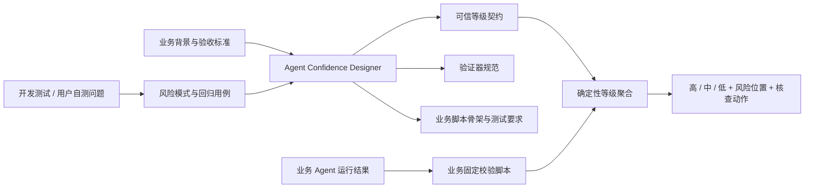

# Agent Confidence

面向业务 Agent + Skill 的可信等级设计方法与开发辅助 Skill。

本仓库解决的问题不是“让大模型给自己的答案打一个分数”，而是帮助团队把开发测试和用户自测中已经发现的问题，沉淀成可执行、可审计的业务验证规则，并在运行时将结果标记为“高 / 中 / 低”可信等级。

## 核心边界

本项目把能力分为两层：

1. **通用层**：最佳实践文档与 `agent-confidence-designer` Skill，负责统一方法、设计流程、输出契约和设计审查。
2. **业务层**：针对具体业务编写的固定校验脚本，负责检查本次运行结果并产生验证证据。

通用 Skill **不直接替代业务校验脚本，也不依赖执行任务的 Agent 自评置信度**。



## 仓库内容

- [`docs/agent-confidence-best-practices.md`](docs/agent-confidence-best-practices.md)：完整最佳实践。
- [`docs/implementation-guide.md`](docs/implementation-guide.md)：业务开发落地指南。
- [`docs/research-conclusion.md`](docs/research-conclusion.md)：调研结论与范围边界。
- [`skills/agent-confidence-designer`](skills/agent-confidence-designer)：通用设计与审查 Skill。
- [`examples`](examples)：Excel 与 Word 业务示例。
- [`tests`](tests)：脚手架与设计校验脚本的自动化测试。

## 快速开始

### 1. 为业务 Agent 创建可信等级设计包

```bash
python skills/agent-confidence-designer/scripts/scaffold_confidence_package.py \
  --agent-id sales-report-agent \
  --agent-name "销售报表 Agent" \
  --output ./confidence-design
```

### 2. 根据业务与测试问题填写设计文件

生成的核心文件包括：

- `confidence-contract.yaml`：结果单元、关键性、高中低规则和验证要求；
- `known-risk-patterns.yaml`：开发测试与用户自测问题沉淀；
- `validator-spec.yaml`：业务验证器的输入、逻辑、状态和等级影响；
- `confidence-review-report.md`：设计审查结论和缺口。

### 3. 检查设计完整性

```bash
python skills/agent-confidence-designer/scripts/validate_confidence_package.py \
  ./confidence-design --strict

python skills/agent-confidence-designer/scripts/check_issue_coverage.py \
  ./confidence-design
```

这些脚本只检查“置信度设计是否完整、自洽和可执行”，不会代替具体业务校验逻辑。

### 4. 运行测试

```bash
python -m pip install -r requirements.txt
make test
make validate-examples
```

## 可信等级语义

| 等级 | 统一含义 | 默认动作 |
|---|---|---|
| 高 | 必要验证已完整执行并通过，未触发关键已知风险，证据可追溯且输入在支持范围内 | 可直接使用或少量抽查 |
| 中 | 没有发现明确关键错误，但验证覆盖不足、存在边界场景或部分内容无法自动验证 | 定向人工检查 |
| 低 | 关键检查失败、关键来源缺失、结果冲突、超出支持范围或触发严重已知缺陷 | 必须人工确认或阻断 |

“未验证”不等于“验证通过”；关键结果缺少必要验证时，不能标记为高。

## 设计原则摘要

- 历史测试问题决定“检查什么”，当前验证结果决定“本次是什么等级”。
- 固定脚本和业务规则优先，大模型只辅助发现脚本难以覆盖的语义风险。
- 高可信必须有正向证据，不能由“没有发现错误”推导。
- 关键子结果失败不能被大量非关键高可信结果平均掉。
- 每个等级都应能追溯到具体检查、证据、风险位置和建议动作。

## 当前状态

这是可用于内部试点的首版。建议先选择一个 Excel 数据处理 Agent 和一个 Word 报告 Agent，使用真实开发测试问题验证方法，再迭代风险分类、模板和设计检查规则。
